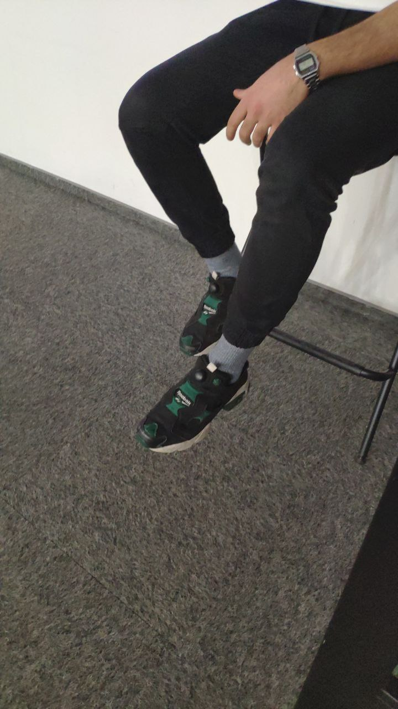
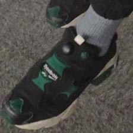

## SneakerShazam
Увидел классные кроссовки на улице, но боишься узнать бренд и название модели? Отправь фотографию обуви боту и узнай ответ. На текущий момент обучен на 20 видах кроссовок (Nike, Adidas, Reebok, Air Jordan)
Бот работает на 2 моделях: YoloV4 и ResNet101V2
Наша первая модель (YoloV4) детектирует кроссовки на фотографии, рисуя вокруг них bounding box. YoloV4 была обучена на 1000 фотографий

Затем по координатам bounding box'а мы обрезаем фотографию и в таком виде передаем второй модели.

Вторая модель (ResNet101V2) нужна для классификации модели кроссовка. ResNet101V2 была обучена на 4000 фотографии 20 классов.
